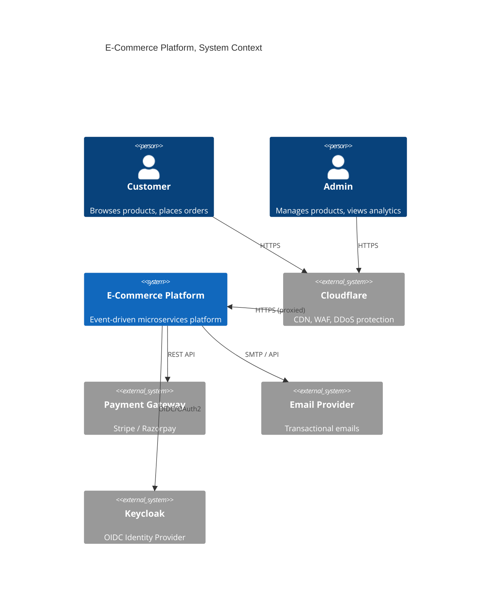
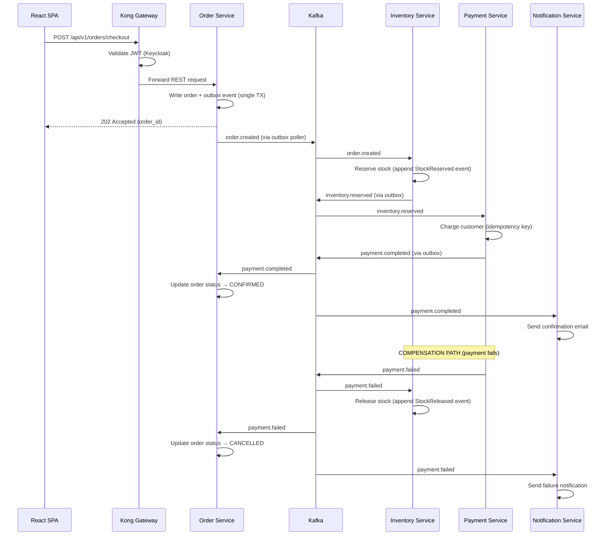
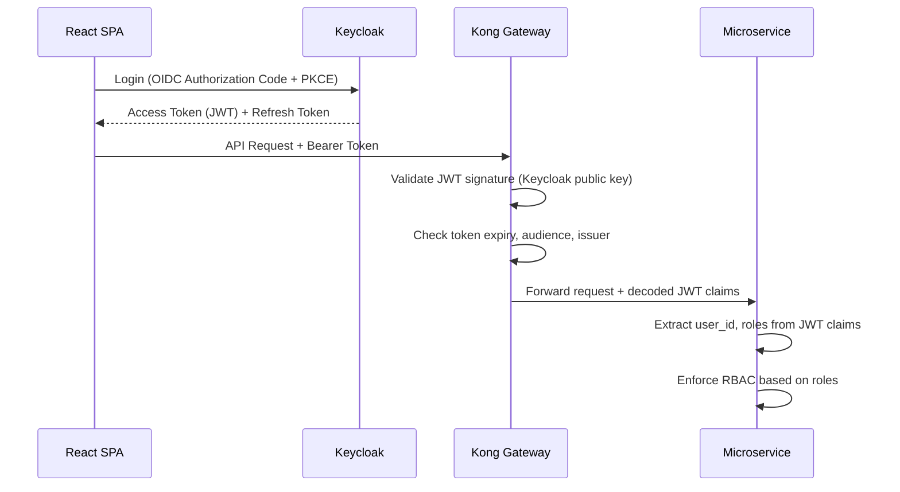
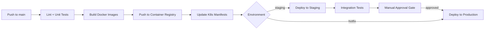

# Enterprise E-Commerce Microservices Architecture
*(Scalable, Event-Driven, Kubernetes-Native)*

## 1. Executive Summary

This document presents a production-grade, event-driven e-commerce platform built on microservices principles. It is designed to demonstrate Solution Architect-level thinking: justified technology trade-offs, failure-mode design, operational maturity, and security-first architecture.

**Core Patterns:** Microservices, Event Sourcing, CQRS, Choreography-based Sagas, Transactional Outbox, Database-per-Service, Circuit Breakers, Infrastructure as Code.

> For all major technology decisions and trade-off analysis, see [Architecture Decision Records](./adrs/).

---

## 2. Technology Stack

| Layer | Technology | Justification |
|---|---|---|
| **Monorepo** | Taskfile (go-task) | Language-agnostic, works for Go, React, and future services. [ADR-001](./adrs/ADR-001-monorepo-tooling.md) |
| **Frontend** | React + TypeScript + MUI | Industry standard SPA stack with strong typing |
| **API Gateway** | Kong (K8s Ingress) | REST routing, JWT validation, rate-limiting. [ADR-002](./adrs/ADR-002-api-gateway.md) |
| **Services** | Go / Gin | High performance, small binaries, strong concurrency. [ADR-003](./adrs/ADR-003-service-language.md) |
| **Primary Database** | PostgreSQL (database-per-service) | Battle-tested ACID, full-text search, event sourcing via append-only tables. [ADR-004](./adrs/ADR-004-database-strategy.md) |
| **Cache** | Redis Cluster | Session state, cart storage, rate-limit counters |
| **Event Backbone** | Apache Kafka | Durable, ordered, replayable event log. [ADR-005](./adrs/ADR-005-event-backbone.md) |
| **Auth** | Keycloak (OIDC/OAuth2) | Centralized identity, RBAC, social login, MFA |
| **Orchestration** | Kubernetes (EKS/GKE) | Industry standard container orchestration |
| **IaC** | Terraform | Declarative, multi-cloud, state-managed infrastructure |
| **CI/CD** | GitHub Actions | Native Git integration, no extra infra. [ADR-006](./adrs/ADR-006-cicd-strategy.md) |
| **Secrets** | Sealed Secrets (Bitnami) | GitOps-compatible, encrypted at rest in Git |
| **Observability** | slog + Prometheus + Grafana | Structured logging, metrics, dashboards. [ADR-007](./adrs/ADR-007-observability.md) |

---

## 3. Architecture Diagrams

### 3.1 C4 Context Diagram, System in its Environment



### 3.2 C4 Container Diagram, Internal Architecture

```mermaid
C4Container
    title E-Commerce Platform, Container Diagram

    Person(customer, "Customer")

    Container_Boundary(edge, "Edge") {
        Container(cdn, "Cloudflare", "CDN/WAF", "DDoS, caching, Anycast")
        Container(spa, "React SPA", "TypeScript, MUI", "Single Page Application")
        Container(kong, "Kong Gateway", "K8s Ingress", "JWT validation, rate-limiting, routing")
    }

    Container_Boundary(services, "Microservices (Go/Gin)") {
        Container(user_svc, "User Service", "Go", "User profiles, addresses")
        Container(product_svc, "Product Service", "Go", "Catalog, full-text search (tsvector)")
        Container(pricing_svc, "Pricing Service", "Go", "Promotions, discount rules")
        Container(cart_svc, "Cart Service", "Go", "Session-based cart")
        Container(order_svc, "Order Service", "Go", "Order lifecycle, Event Sourcing, Saga")
        Container(inventory_svc, "Inventory Service", "Go", "Stock management, Event Sourcing")
        Container(payment_svc, "Payment Service", "Go", "Payment processing")
        Container(notification_svc, "Notification Service", "Go", "Email/SMS dispatch")
    }

    Container_Boundary(data, "Data Layer") {
        ContainerDb(pg, "PostgreSQL Cluster", "PostgreSQL 16", "Database-per-service isolation")
        ContainerDb(redis, "Redis Cluster", "Redis 7", "Sessions, carts, rate-limit counters")
        ContainerQueue(kafka, "Apache Kafka", "Kafka 3.x", "Domain events, Saga choreography, DLQs")
    }

    Container_Boundary(obs, "Observability") {
        Container(prometheus, "Prometheus", "Metrics", "Scrapes /metrics endpoints")
        Container(grafana, "Grafana", "Dashboards", "Metrics + logs visualization")
    }

    Rel(customer, cdn, "HTTPS")
    Rel(cdn, spa, "Static assets")
    Rel(spa, kong, "REST API calls")
    Rel(kong, user_svc, "REST")
    Rel(kong, product_svc, "REST")
    Rel(kong, cart_svc, "REST")
    Rel(kong, order_svc, "REST")

    Rel(order_svc, kafka, "Publishes order events")
    Rel(inventory_svc, kafka, "Consumes/publishes inventory events")
    Rel(payment_svc, kafka, "Consumes/publishes payment events")
    Rel(notification_svc, kafka, "Consumes notification events")

    Rel(user_svc, pg, "user_db")
    Rel(product_svc, pg, "product_db")
    Rel(order_svc, pg, "order_db")
    Rel(inventory_svc, pg, "inventory_db")
    Rel(payment_svc, pg, "payment_db")
    Rel(cart_svc, redis, "Session store")

    Rel(prometheus, services, "Scrapes /metrics")
    Rel(grafana, prometheus, "Queries")
```

---

## 4. Core Microservices

### 4.1 Service Catalog

| # | Service | Database | Key Responsibility | Patterns |
|---|---|---|---|---|
| 1 | **User Service** | `user_db` (PG) | User profiles, addresses | CRUD, REST |
| 2 | **Product Service** | `product_db` (PG) | Catalog, search | CQRS (tsvector read-model) |
| 3 | **Pricing Service** | `pricing_db` (PG) | Promotions, discount rules | Config-driven rule engine |
| 4 | **Cart Service** | Redis Cluster | Session-based cart | Volatile state, TTL-based expiry |
| 5 | **Order Service** | `order_db` (PG) | Order lifecycle | Event Sourcing, Saga coordinator |
| 6 | **Inventory Service** | `inventory_db` (PG) | Stock management | Event Sourcing, Saga participant |
| 7 | **Payment Service** | `payment_db` (PG) | Payment processing | Saga participant, idempotency keys |
| 8 | **Notification Service** | None | Email/SMS dispatch | Kafka consumer, fire-and-forget |

### 4.2 Database-per-Service Strategy

One PostgreSQL cluster, **strict database-level isolation**. Services **never** query another service's database. Cross-service data flows only through Kafka events or synchronous REST calls.

| Service | Database | Key Tables |
|---|---|---|
| User Service | `user_db` | `users`, `addresses`, `profiles` |
| Product Service | `product_db` | `products`, `categories`, search index (`tsvector`) |
| Cart Service | **Redis only** |, |
| Order Service | `order_db` | `orders`, `order_items`, `events`, `outbox` |
| Payment Service | `payment_db` | `payments`, `refunds`, `outbox` |
| Inventory Service | `inventory_db` | `events`, `inventory_snapshot` |
| Pricing Service | `pricing_db` | `promotions`, `discount_rules` |
| Notification Service | None |, |

**Why one cluster, not N clusters?** See [ADR-004](./adrs/ADR-004-database-strategy.md).

---

## 5. Event Backbone & Kafka Topology

### 5.1 Topic Design

| Topic | Producer | Consumers | Purpose |
|---|---|---|---|
| `order.events` | Order Service | Inventory, Payment, Notification | Order lifecycle events |
| `inventory.events` | Inventory Service | Order, Notification | Stock reservation/release |
| `payment.events` | Payment Service | Order, Notification | Payment success/failure |
| `notification.commands` | Various | Notification Service | Email/SMS dispatch commands |
| `*.dlq` | Kafka consumers | Ops dashboard | Dead letter queues per topic |

### 5.2 Schema Enforcement
Shared Go structs in `pkg/events/` define all event contracts. JSON Schema validation occurs at the producer and consumer boundaries. See [ADR-005](./adrs/ADR-005-event-backbone.md) for why we chose this over Confluent Schema Registry.

---

## 6. Distributed Transactions & Saga Flow

### 6.1 Transactional Outbox Pattern
Services write domain events to an `outbox` table within the **same database transaction** as the state change. A lightweight Go **outbox poller** (per service) reads uncommitted outbox rows and publishes them to Kafka, then marks them as published.

```
BEGIN TRANSACTION
  INSERT INTO orders (id, status, ...) VALUES (...);
  INSERT INTO outbox (event_type, payload, published) VALUES ('order.created', '{...}', false);
COMMIT
```

This guarantees **atomicity** between database writes and event publishing without two-phase commits.

### 6.2 Choreography-based Saga, Checkout Flow



---

## 7. Resilience Patterns

### 7.1 Circuit Breakers
Every synchronous outbound call (e.g., Order Service → Pricing Service REST call, Payment Service → Stripe API) is wrapped in a **circuit breaker** (using `sony/gobreaker`).

| State | Behavior |
|---|---|
| **Closed** | Requests flow normally. Failures are counted. |
| **Open** | All requests fail-fast immediately. No load on downstream. |
| **Half-Open** | A single probe request is allowed. Success → Closed. Failure → Open. |

**Config:** 5 consecutive failures → Open. 30s timeout → Half-Open. 3 successes → Closed.

### 7.2 Retry Policy with Exponential Backoff + Jitter
All Kafka consumers and HTTP clients implement retries with exponential backoff and **jitter** to prevent thundering herd:

```
delay = min(base * 2^attempt + random_jitter, max_delay)
```

**Config:** base=100ms, max_delay=30s, max_retries=5.

### 7.3 Timeouts & Deadlines
Every REST call has a **context timeout**:
- Internal service-to-service: 3s
- External APIs (Stripe/Razorpay): 10s
- Database queries: 5s

### 7.4 Idempotency
All Kafka consumers are **idempotent**. Each event carries a unique `event_id`. Consumers maintain a `processed_events` table and skip duplicates:

```
INSERT INTO processed_events (event_id) VALUES ($1) ON CONFLICT DO NOTHING;
-- If rowsAffected == 0, event was already processed → skip
```

Payment Service uses **idempotency keys** for external gateway calls to prevent double-charging.

### 7.5 Backpressure & Consumer Lag
- Kafka consumers use **manual offset commits** (commit only after successful processing).
- **Consumer lag** is exposed as a Prometheus metric. Grafana alerts fire when lag exceeds threshold (e.g., >10,000 messages for 5 minutes).
- Horizontal scaling: increase consumer group instances to match partition count.

### 7.6 Dead Letter Queues (DLQ)
After max retries, unprocessable messages are routed to a per-topic DLQ (e.g., `order.events.dlq`). DLQ messages retain full headers and metadata for debugging and replay.

### 7.7 Bulkhead Isolation
Each service runs in its own K8s Deployment with **resource limits** (CPU/memory). A runaway service cannot starve others. HTTP thread pools are bounded per downstream dependency.

---

## 8. API Design Strategy

### 8.1 Contract-First Development
All APIs are designed **contract-first** using **OpenAPI 3.0** specifications. The spec is written before implementation and serves as the single source of truth.

```
/services/user-service/api/openapi.yaml    ← Contract
/services/user-service/internal/handler/    ← Generated server stubs
```

### 8.2 Versioning Strategy
- **URL path versioning:** `/api/v1/orders`, `/api/v2/orders`
- New versions are only created for **breaking changes**.
- Non-breaking additions (new optional fields) are added to the current version.
- Old versions are supported for **2 release cycles** with deprecation headers.

### 8.3 Standard Response Envelope

```json
{
  "data": { ... },
  "meta": { "request_id": "uuid", "timestamp": "ISO8601" },
  "errors": [{ "code": "INSUFFICIENT_STOCK", "message": "...", "field": "quantity" }]
}
```

### 8.4 Pagination
Cursor-based pagination for all list endpoints (not offset-based, offset degrades at scale):

```
GET /api/v1/products?cursor=eyJpZCI6MTAwfQ&limit=25
```

---

## 9. Security Architecture

### 9.1 Authentication Flow



### 9.2 RBAC Model

| Role | Permissions |
|---|---|
| `customer` | Browse products, manage own cart/orders/profile |
| `admin` | All customer permissions + manage products, view all orders, manage promotions |
| `service` | Service-to-service calls (service accounts in Keycloak) |

### 9.3 Service-to-Service Authentication
Internal REST calls between services carry a **service account JWT** obtained from Keycloak's client credentials flow. Kong validates these tokens the same way it validates user tokens, no special treatment.

### 9.4 Security Hardening

| Concern | Mitigation |
|---|---|
| **Input Validation** | All request bodies validated against OpenAPI schema before handler logic |
| **SQL Injection** | Parameterized queries only (Go `database/sql` with `$1` placeholders) |
| **XSS** | React auto-escapes by default, CSP headers via Kong |
| **CSRF** | Not applicable (JWT Bearer tokens, no cookies for auth) |
| **Rate Limiting** | Kong rate-limiting plugin per consumer + per IP |
| **Secrets** | Never in env vars or code, Sealed Secrets decrypted only in K8s cluster |
| **Transport** | TLS everywhere, Cloudflare → Kong is HTTPS, K8s internal via NetworkPolicies |
| **Dependency Scanning** | `govulncheck` and `npm audit` in CI pipeline |
| **Container Security** | Distroless base images, non-root containers, read-only filesystems |

---

## 10. Observability

### 10.1 Three Pillars

| Pillar | Tool | Implementation |
|---|---|---|
| **Logging** | Go `slog` (structured JSON) | Every service writes structured JSON logs to stdout. K8s collects via container runtime. |
| **Metrics** | Prometheus + Grafana | Each service exposes `/metrics` endpoint. Prometheus scrapes, Grafana visualizes. |
| **Health** | `/healthz` + `/readyz` | K8s liveness and readiness probes per service |

### 10.2 Standard Log Format

```json
{
  "time": "2026-05-10T05:30:00Z",
  "level": "INFO",
  "msg": "order created",
  "service": "order-service",
  "request_id": "550e8400-e29b-41d4-a716-446655440000",
  "user_id": "usr_123",
  "order_id": "ord_456",
  "duration_ms": 42
}
```

Every request gets a unique `request_id` (generated at Kong, propagated via `X-Request-ID` header) for end-to-end tracing across services.

### 10.3 Key Metrics (Prometheus)

| Metric | Type | Description |
|---|---|---|
| `http_requests_total` | Counter | Total requests by service, method, path, status |
| `http_request_duration_seconds` | Histogram | Request latency distribution |
| `kafka_consumer_lag` | Gauge | Messages behind per consumer group/topic |
| `kafka_messages_processed_total` | Counter | Events processed by type |
| `circuit_breaker_state` | Gauge | 0=closed, 1=open, 2=half-open |
| `outbox_pending_count` | Gauge | Unpublished outbox events |
| `db_pool_active_connections` | Gauge | Database connection pool utilization |

### 10.4 Grafana Dashboards
- **Service Health:** Request rate, error rate (5xx), p50/p95/p99 latency per service
- **Kafka Health:** Consumer lag, throughput, DLQ message count
- **Infrastructure:** Pod CPU/memory, PG connection pool, Redis memory usage

---

## 11. Deployment Strategy

### 11.1 CI/CD Pipeline (GitHub Actions)



### 11.2 Deployment Model, Rolling Updates with Readiness Gates
- **Strategy:** `RollingUpdate` with `maxSurge=1, maxUnavailable=0` (zero-downtime).
- New pods must pass **readiness probes** (`/readyz`, checks DB connection, Kafka producer health) before receiving traffic.
- Old pods are drained gracefully (K8s `preStop` hook + connection draining).

### 11.3 Database Migration Strategy
- Migrations run as **Kubernetes Jobs** (init-containers) before the service Deployment rolls out.
- **Expand-and-Contract pattern:** Breaking schema changes are split into two releases:
  1. **Expand:** Add new column (nullable) → deploy code that writes to both old and new → backfill.
  2. **Contract:** Next release drops the old column after all consumers are updated.
- This guarantees zero-downtime schema evolution.

### 11.4 Rollback Plan
- K8s native: `kubectl rollout undo deployment/<service>`
- Container images are immutable and tagged with Git SHA, rollback = redeploy a known-good SHA.
- Database rollbacks: each migration has a corresponding `down` migration.

---

## 12. Capacity & Scaling Strategy

### 12.1 Horizontal Scaling

| Service | Scaling Trigger | Strategy |
|---|---|---|
| **All Go services** | CPU > 70% or RPS > threshold | K8s HPA (Horizontal Pod Autoscaler) |
| **Kafka consumers** | Consumer lag > 10k for 5min | Scale pods up to partition count |
| **PostgreSQL** | Connection pool saturation | Read replicas for read-heavy services (Product) |
| **Redis** | Memory > 80% | Cluster resharding |

### 12.2 Bottleneck Analysis

| Bottleneck | Location | Mitigation |
|---|---|---|
| **Write contention** | Inventory Service (stock updates) | Event Sourcing = append-only writes (no row locks) |
| **Search load** | Product Service | PostgreSQL `tsvector` index + read replicas + Redis caching for hot queries |
| **Payment latency** | External gateway (Stripe) | Async via Kafka, circuit breaker prevents cascade, 10s timeout |
| **Kafka throughput** | Topic partition count | Start with 12 partitions per topic, increase as consumer count grows |

### 12.3 Load Profile (Target)
- **Steady state:** ~1,000 concurrent users, ~200 orders/min
- **Peak (sale events):** ~10,000 concurrent users, ~2,000 orders/min
- **Scaling ceiling:** Kafka partitions + HPA pods. Horizontal scaling is linear up to PostgreSQL write limits.

---

## 13. Monorepo Management (Taskfile)

All build, test, run, and deploy tasks are managed via **Taskfile (go-task)**.

```bash
task dev:frontend           # Start React dev server
task dev:user-service       # Start user service locally
task build:all              # Build all services
task docker:build:all       # Build all Docker images
task test:all               # Run all tests across all services
task test:integration       # Run integration tests
task db:migrate:all         # Run all database migrations
task lint:all               # Lint Go + TypeScript
```

---

## 14. Directory Structure

```
/sol_arch_proj
├── Taskfile.yml                # Monorepo task runner
├── docs/
│   ├── ecommerce-microservices-design.md   # This document
│   └── adrs/                              # Architecture Decision Records
│       ├── ADR-001-monorepo-tooling.md
│       ├── ADR-002-api-gateway.md
│       ├── ADR-003-service-language.md
│       ├── ADR-004-database-strategy.md
│       ├── ADR-005-event-backbone.md
│       ├── ADR-006-cicd-strategy.md
│       └── ADR-007-observability.md
├── terraform/                  # IaC: AWS VPC, EKS, RDS, MSK
├── k8s-manifests/
│   ├── base/                   # Deployments, Services, ConfigMaps, HPA
│   └── overlays/               # staging, production
├── .github/
│   └── workflows/              # CI/CD pipelines
├── api-gateway/                # Kong configuration + rate-limit policies
├── pkg/                        # Shared Go Libraries
│   ├── events/                 # Event structs + JSON schema validation
│   ├── outbox/                 # Transactional outbox poller library
│   ├── circuitbreaker/         # Circuit breaker wrapper (sony/gobreaker)
│   ├── middleware/             # Auth, request-ID, logging, metrics middleware
│   └── httputil/               # Standard response envelope, pagination helpers
├── services/
│   ├── user-service/
│   │   ├── api/openapi.yaml    # OpenAPI 3.0 contract
│   │   ├── cmd/main.go
│   │   ├── internal/           # handler, service, repository layers
│   │   ├── migrations/
│   │   └── Dockerfile
│   ├── product-service/        # PostgreSQL (product_db, tsvector search)
│   ├── pricing-service/        # PostgreSQL (pricing_db, rule engine)
│   ├── cart-service/           # Redis Cluster
│   ├── inventory-service/      # PostgreSQL (inventory_db, Event Sourced)
│   ├── order-service/          # PostgreSQL (order_db, Event Sourced, Saga)
│   ├── payment-service/        # PostgreSQL (payment_db, idempotency)
│   └── notification-service/   # Kafka consumer, email/SMS dispatch
└── frontend/
    ├── package.json
    ├── src/
    │   ├── components/         # MUI components
    │   └── api/                # Axios REST client + OpenAPI types
    └── Dockerfile
```

---

## 15. Key Architectural Patterns Demonstrated

| Pattern | Where | Why It Matters |
|---|---|---|
| **Database-per-Service** | All services | Loose coupling, independent deployability |
| **Event Sourcing** | Order + Inventory | Full audit trail, temporal queries, no data loss |
| **CQRS** | Product Service (tsvector) | Optimized read-model, decoupled from writes |
| **Transactional Outbox** | Order, Inventory, Payment | Atomic DB write + event publish without 2PC |
| **Choreography Saga** | Checkout flow | Distributed transaction with compensating actions |
| **Circuit Breaker** | All outbound HTTP calls | Prevents cascading failures |
| **Idempotent Consumers** | All Kafka consumers | Safe at-least-once delivery |
| **Contract-First API** | All REST services | OpenAPI spec before code, backward compatibility |
| **Infrastructure as Code** | Terraform | Reproducible, auditable infrastructure |
| **GitOps-style CI/CD** | GitHub Actions | Declarative deployments, no manual cluster access |