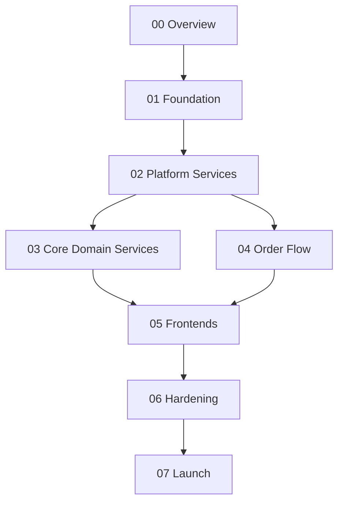

# Phase Map

## Dependency graph

Phases 03 and 04 can run in parallel once 02 is complete — different teams (or different days) can pick them up independently. Frontends (05) need browse APIs (03) for storefront and checkout APIs (04) for cart/checkout pages.

## What each milestone unlocks

| Milestone | Phases | Unlocks |
|---|---|---|
| **M1** | 01 + 02 | A K8s cluster with Kong, Keycloak, Postgres, Redis, Kafka, Prometheus, Grafana — empty platform ready for services |
| **M2** | 03 + 04 | All eight services running; happy-path checkout completes end-to-end via curl/Postman |
| **M3** | 05 | Customers can buy on mobile and web; admins can run the store |
| **M4** | 06 + 07 | Production-ready: SLOs met, load test sustains peak profile, DR drill passes, sign-offs collected |

## Parallelization within phases

Within `02-platform-services/`, the workstreams (Keycloak, Kong, Postgres, Redis, Kafka, observability) are mostly independent and can be set up in parallel. The `shared-go-libs` sub-file is on the critical path for phases 03/04 — start it first.

Within `04-order-flow/`, the four services depend on each other through Kafka topics; build the topics + outbox infrastructure first, then bring up Order, then Inventory + Payment in parallel, then Notification last.
