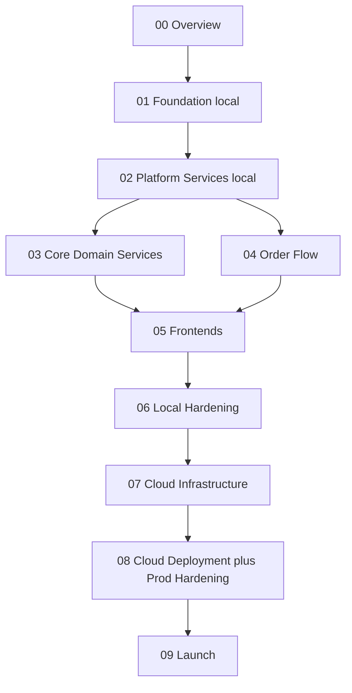

# Phase Map

## Build approach

Local-first. Phases 01 through 06 run entirely on a developer laptop using Docker Compose, Taskfile, and CI workflows that only lint, test, and build. No cloud account, no Terraform, and no Kubernetes cluster is required until phase 07. This lets the architecture be proven end-to-end (eight services, four frontends, full checkout) before paying for or committing to any cloud substrate.

## Dependency graph

Phases 03 and 04 can run in parallel once 02 is complete. Frontends (05) need browse APIs (03) for storefront and checkout APIs (04) for cart and checkout pages.

## What each milestone unlocks

| Milestone | Phases | Unlocks |
|---|---|---|
| **M1** | 01 plus 02 | `task up` boots Kong, Keycloak, Postgres, Redis, Kafka, Prometheus, Grafana locally. Empty platform ready for services. |
| **M2** | 03 plus 04 | All eight services running locally. Happy-path checkout completes end-to-end via curl or Postman against `localhost`. |
| **M3** | 05 | Customer mobile and web, plus admin web, all wired to local backend. Full UX walkable on the dev machine. |
| **M4** | 06 | Threat model signed off, security scans clean, k6 load test against local stack within budget, runbook drafts authored. |
| **M5** | 07 plus 08 | Cloud infra provisioned via Terraform, services deployed to staging, chaos, DR, and SLOs proven on real infra. |
| **M6** | 09 | Production rollout completed, sign-offs collected, post-launch monitoring window staffed. |

## Parallelization within phases

Within `02-platform-services/`, the workstreams (Keycloak, Kong, Postgres, Redis, Kafka, observability) are mostly independent docker-compose services and can be wired up in parallel. The `shared-go-libs` sub-file is on the critical path for phases 03 and 04, so start it first.

Within `04-order-flow/`, the four services depend on each other through Kafka topics. Build the topics and outbox infrastructure first, then bring up Order, then Inventory and Payment in parallel, then Notification last.

Within `08-cloud-deployment/`, deploy workflows and manifests must land before chaos, DR, and alerting can be exercised against the deployed system.
