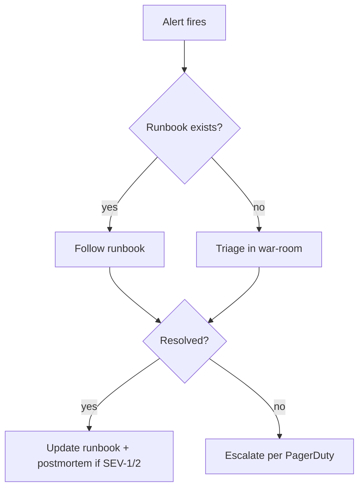

# Post-Launch Monitoring

## Purpose

A defined window of heightened attention after each ramp step. Most launches that fail, fail in the first 72 hours — invest disproportionate vigilance there.

## Inputs / Prerequisites

- Launch is live (any traffic stage ≥ 1%)
- Dashboards and alerts wired ([`../06-hardening/slos.md`](../06-hardening/slos.md), [`../06-hardening/alerting.md`](../06-hardening/alerting.md))

## Tasks / Watch Windows

### First 24 hours

- [ ] On-call primary + secondary in war-room continuously
- [ ] Dashboards on display: SLO overview, Saga timeline, Kafka health, Stripe success rate
- [ ] Manual spot-check every 30 min for first 8 hours, hourly thereafter
- [ ] Status-page update on any anomaly

### 24h–72h

- [ ] On-call returns to normal rotation but stays in war-room channel
- [ ] Daily standup review of SLOs, alerts fired, customer-reported issues
- [ ] Cloudflare WAF tuning based on real traffic patterns
- [ ] Capacity check: HPA replica counts vs. max, headroom report

### 72h–7d

- [ ] Daily SLO + error-budget review
- [ ] First batch of customer-feedback synthesis (from support tickets, app store reviews)
- [ ] Adjust alert thresholds based on real noise

### Day +7

- [ ] Launch retrospective: what went well, what surprised us, what to change
- [ ] Postmortems for any SEV-1/SEV-2 incidents during the window
- [ ] Update runbooks with any new failure modes discovered

## Triage flow

## Deliverables

- War-room transcript archived
- Launch retro doc at `docs/postmortems/launch-YYYY-MM-DD.md`
- Updated runbooks with new failure modes
- Postmortems for any SEV-1/2 incidents

## Exit Criteria

- [ ] 7-day window complete with no unresolved SEV-1
- [ ] Retrospective held; action items filed
- [ ] On-call schedule back to normal cadence

## References

- Design doc: §10 Observability, §11 Deployment Strategy

## Risks & Open Questions

- Fatigue after 72h is real — enforce rest breaks for on-call. Two-person war room minimum.
- Real customer behavior diverges from synthetic loads. Expect surprises and treat them as data, not failures.
